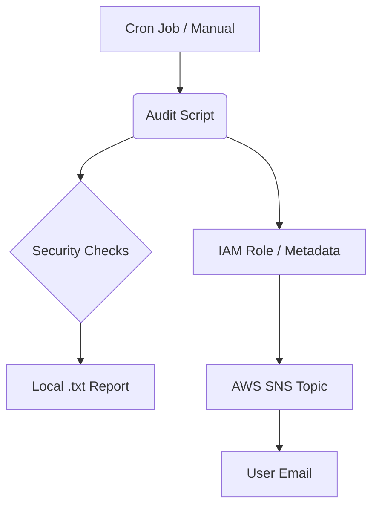

# Ubuntu Audit

**Ubuntu Audit** is a basic security auditing script designed for Ubuntu EC2 instances. It performs essential system security checks and sends the full report to your email via **Amazon SNS**.

---

## Architecture



## Quick Start

Run this command to download and prepare the script instantly:

```bash
curl -O https://raw.githubusercontent.com/emirctl/ubuntu-audit/main/ubuntu-audit.sh && chmod +x ubuntu-audit.sh
```

After downloading, edit the script to add your SNS_TOPIC_ARN.

## AWS Setup

This script uses IAM Roles for secure communication. No Access Keys are required.

SNS Topic: Create a Standard Topic in AWS SNS and copy its ARN.

Subscription: Subscribe your email to the Topic and confirm the link in your inbox.

IAM Role: Create an IAM Role for EC2 with the AmazonSNSFullAccess policy.

Attach: Attach this role to your EC2 instance.

## Features

SSH Audit: Checks for Root Login and Password Authentication.

Intrusion Detection: Monitors failed login attempts (last 24h).

Network Security: Lists externally exposed inbound ports.

Firewall: Verifies UFW status.

Updates: Checks for pending security patches and unattended-upgrades.


## Automation

To run the audit automatically every hour, add it to the root crontab:

Open crontab: sudo crontab -e

Add this line:

```cron
0 * * * * /bin/bash /path/to/ubuntu-audit.sh >> /path/to/audit-cron.log 2>&1
```
📄
## License

This project is licensed under the MIT License.
